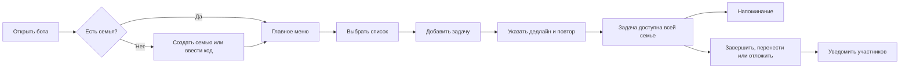
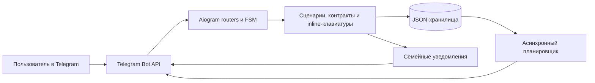

# Easy Task Manager

### Семейный список дел прямо в Telegram

**Общие задачи, дедлайны и напоминания в привычном семейном чате с ботом.**

> [!NOTE]
> Это публичная витрина продукта. Исходный код, конфигурация развертывания и рабочие данные хранятся в закрытом репозитории.

<!-- IMAGE SLOT: HERO -->
> [!IMPORTANT]
> **📷 Место для обложки продукта**  
> Рекомендуемый файл: `docs/images/hero.png` · формат 16:9 · 1600×900 px  
> Содержание: главное меню бота, список задач и карточка задачи в одном композиционном кадре.

## О продукте

Easy Task Manager помогает семье вести общие дела там, где уже происходит повседневное общение — в Telegram. Участники создают единую семью, добавляют задачи в тематические списки, получают уведомления о действиях друг друга и совместно контролируют сроки.

Продукт задуман для коротких бытовых сценариев: купить продукты, оплатить счет, подготовиться к поездке, записаться к врачу или выполнить регулярное домашнее дело. Для работы с задачами достаточно личного диалога с ботом и inline-кнопок.

## Какую проблему решает

| Проблема | Решение в Easy Task Manager |
|---|---|
| Договоренности теряются среди сообщений | Каждое дело становится отдельной задачей с понятным статусом |
| За общими делами следит один человек | Все участники семьи видят единые списки и получают уведомления |
| Сроки приходится держать в голове | Бот напоминает утром, вечером и в точное время дедлайна |
| Для бытовой задачи долго открывать отдельный сервис | Основные действия доступны внутри Telegram |
| Повторяющиеся дела приходится создавать заново | Задачи поддерживают ежедневный, еженедельный и ежемесячный повтор |

## Возможности

### Совместная семья

- создание отдельного семейного пространства;
- присоединение по одноразовому коду или Telegram-ссылке;
- общий доступ к задачам и спискам;
- уведомления о присоединении и удалении участников;
- управление составом семьи и удаление семейного пространства.

### Работа с задачами

- добавление задачи через пошаговый сценарий;
- выбор тематического списка;
- дедлайн с датой и точным временем;
- завершение задачи кнопкой `Сделал`;
- перенос между списками;
- изменение или удаление дедлайна;
- ежедневное, еженедельное и ежемесячное повторение;
- откладывание до вечера, завтра, выходных, следующей недели или выбранной даты.

### Списки и навигация

В продукте предусмотрены готовые категории: `Общий`, `Покупки`, `Дом`, `Дача`, `Отпуск`, `Здоровье` и `Работа`.

Задачи сортируются по срочности. Большие списки разбиваются на страницы по шесть задач, а возврат из карточки сохраняет текущую страницу.

### Напоминания

- утренняя сводка в 09:00;
- вечерняя сводка в 18:00;
- уведомление в точное время дедлайна;
- защита от повторной отправки после перезапуска;
- автоматическое перепланирование ближайшего напоминания после изменений задачи.

## Основной пользовательский сценарий

## Галерея интерфейса

<table>
  <tr>
    <td width="50%" align="center">
      <strong>📷 Онбординг семьи</strong>  
      <code>docs/images/onboarding.png</code>  
      Создание семьи, приглашение и присоединение по коду. 
      Рекомендуемый размер: 900×1200 px.
    </td>
    <td width="50%" align="center">
      <strong>📷 Главное меню и списки</strong>  
      <code>docs/images/lists.png</code>  
      Главное меню, категории и список активных задач. 
      Рекомендуемый размер: 900×1200 px.
    </td>
  </tr>
  <tr>
    <td width="50%" align="center">
      <strong>📷 Создание задачи</strong>  
      <code>docs/images/add-task.png</code>  
      Выбор списка, текста, срока, времени и повторения. 
      Рекомендуемый размер: 900×1200 px.
    </td>
    <td width="50%" align="center">
      <strong>📷 Карточка и напоминание</strong>  
      <code>docs/images/task-reminder.png</code>  
      Действия с задачей и пример уведомления о дедлайне. 
      Рекомендуемый размер: 900×1200 px.
    </td>
  </tr>
</table>

## Техническая реализация

| Область | Реализация |
|---|---|
| Интерфейс | Telegram Bot API и inline-клавиатуры |
| Backend | Python 3.9+ и aiogram 3.x |
| Диалоговые сценарии | Routers и Finite State Machine |
| Фоновые процессы | `asyncio`-планировщик напоминаний с возможностью пробуждения и перепланирования |
| Данные MVP | Изолированные JSON-хранилища задач, списков, семей и состояния напоминаний |
| Время | Часовой пояс `Europe/Moscow` |
| Качество | Модульные тесты для хранилищ и ключевой бизнес-логики |

Код разделен по зонам ответственности: обработчики Telegram-событий, контракты текстов и callback-команд, генераторы клавиатур, работа с дедлайнами и повторениями, уведомления, планировщик и слой хранения данных.

## Продуктовые решения

- **Telegram-first UX.** Пользователю не требуется осваивать новый интерфейс или заводить отдельную учетную запись.
- **Семья как единица изоляции.** Задачи, списки и уведомления привязаны к отдельному семейному пространству.
- **Одноразовые приглашения.** Код перестает работать после успешного присоединения.
- **Событийные уведомления.** Участники видят, кто создал, завершил, изменил срок или отложил задачу.
- **Устойчивые напоминания.** Состояние плановых отправок сохраняется, поэтому перезапуск бота не создает дубли.
- **Эволюционная архитектура MVP.** Локальное хранение ускоряет проверку сценариев и оставляет понятный путь к переходу на СУБД.

## Моя роль в проекте

- сформулировал продуктовую задачу и границы MVP;
- спроектировал пользовательские сценарии и диалоговый UX;
- определил модель семьи, списков, задач, дедлайнов и уведомлений;
- организовал разработку с использованием AI coding agents;
- проводил приемку, тестирование и итерационную доработку продукта;
- подготовил публичную витрину при сохранении исходного кода в закрытом контуре.

## Что демонстрирует кейс

Этот проект показывает полный цикл создания небольшого цифрового продукта: от бытовой проблемы и сценариев использования до работающего Telegram-бота, фоновой логики, модели данных, тестов и решений по приватности.

Особое внимание уделено практической сборке решения: декомпозиции требований, проектированию состояний диалога, обработке граничных случаев, совместной работе нескольких пользователей и надежной доставке напоминаний.

## Текущий статус

**Working MVP.** Telegram-интерфейс и основные семейные сценарии реализованы и используются как самостоятельный продукт.

Возможные направления развития:

- переход с файлового хранения на PostgreSQL;
- настройка часового пояса и персональных напоминаний;
- визуальный интерфейс Telegram Mini App;
- история действий и завершенных задач;
- наблюдаемость, автоматический деплой и резервное копирование.

## Приватность

Рабочие файлы могут содержать Telegram chat ID и пользовательские данные. Они исключены из публичной витрины и хранятся только в закрытом окружении проекта.

---

**Easy Task Manager — практический кейс Telegram-first продукта для совместного управления повседневными делами.**

